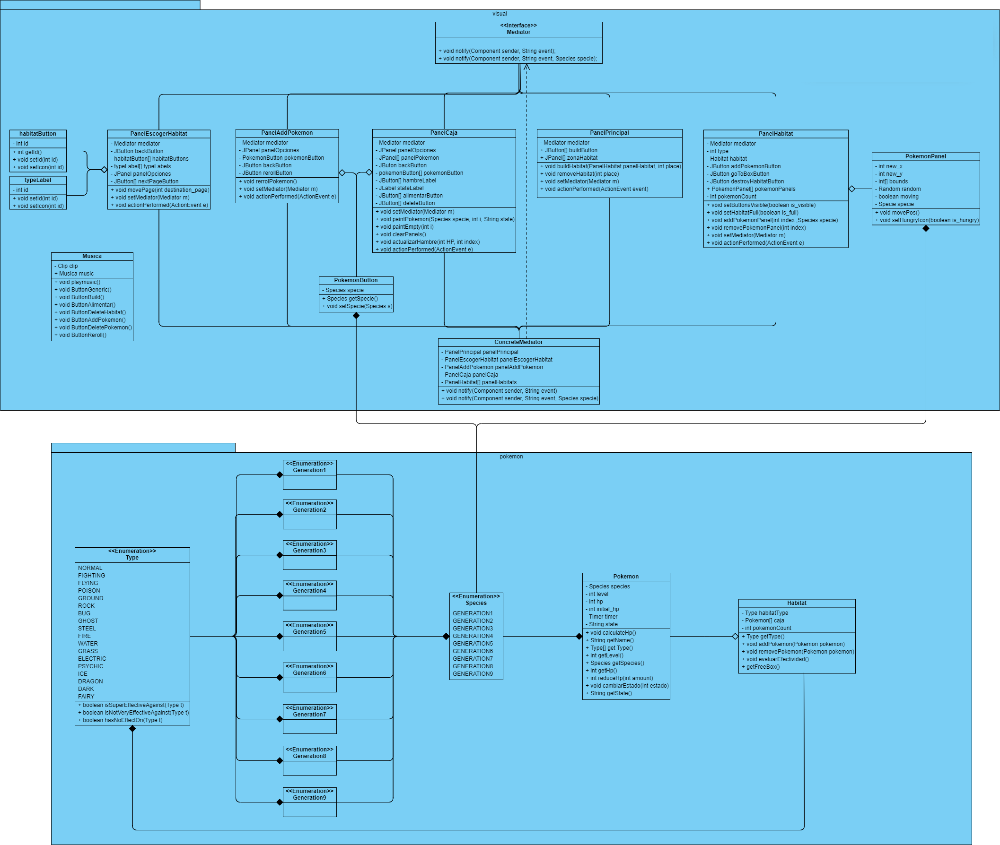
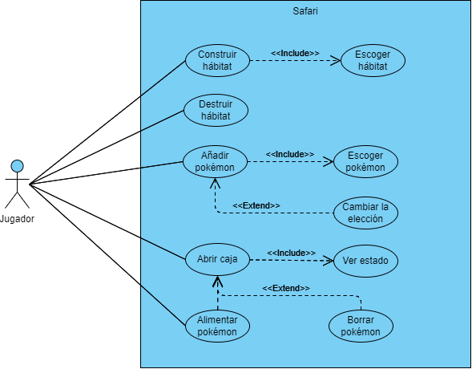
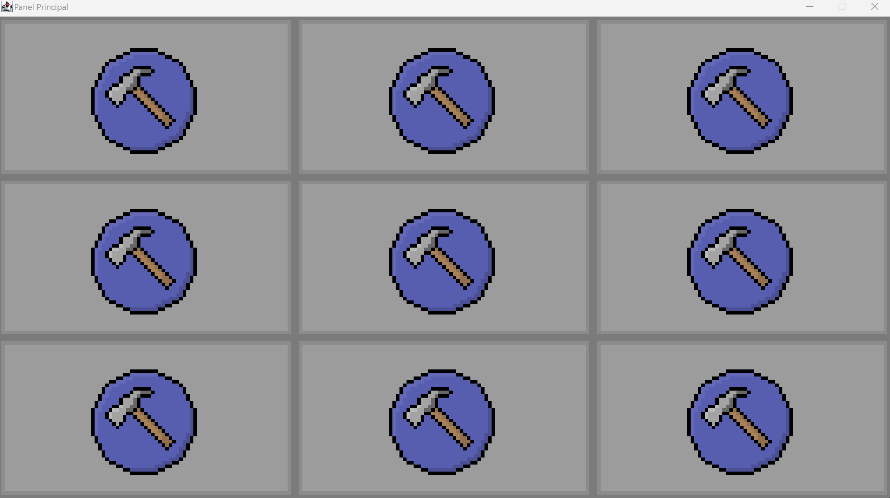
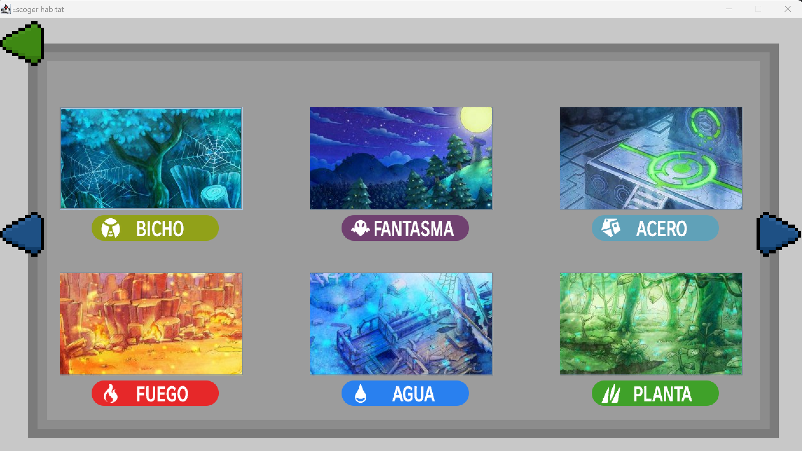
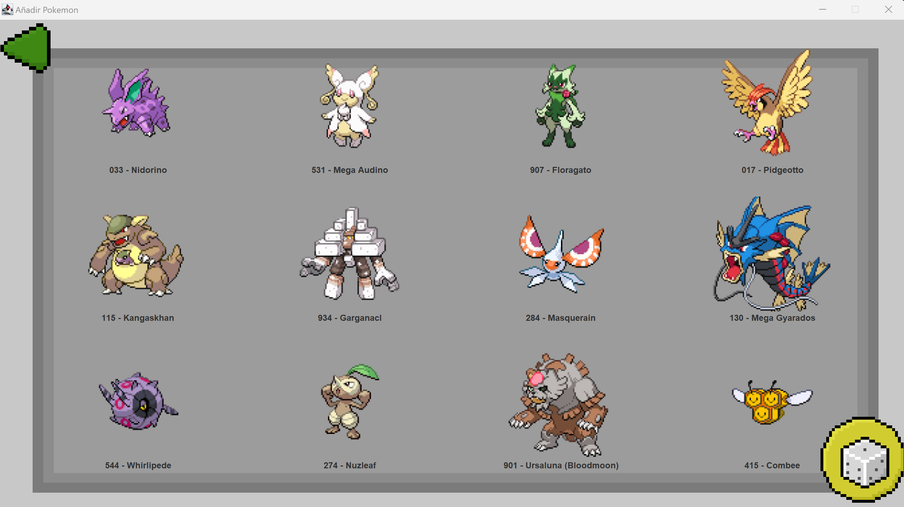
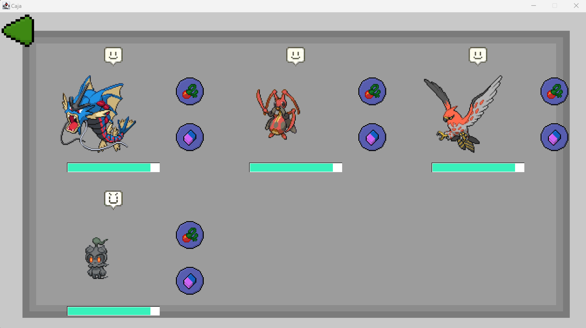
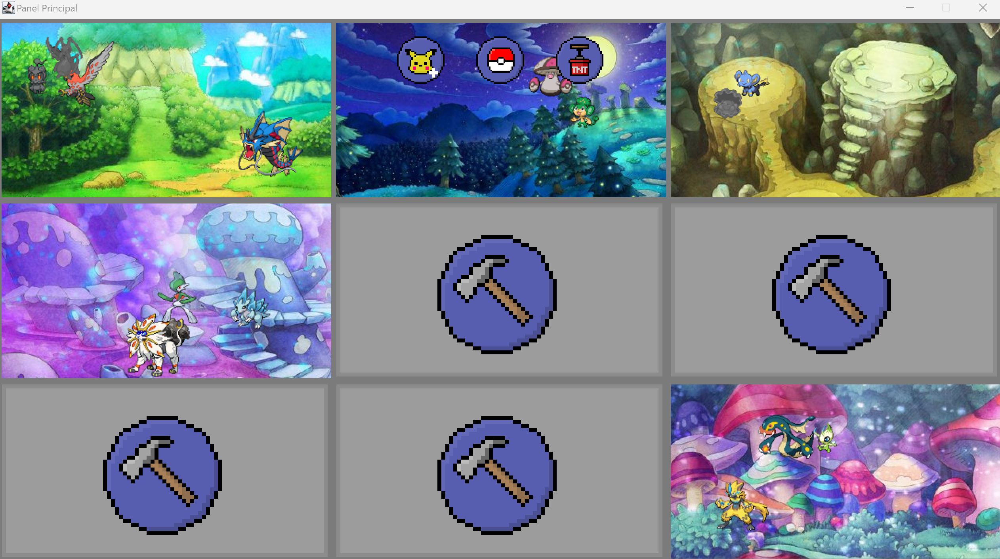

# Proyecto-Final-DOO
## Tema 3: Simulador de zoo
- El simulador de zoo permite a los usuarios crear y gestionar su propio zoológico virtual de manera interactiva. Los usuarios tienen la capacidad de construir diferentes hábitats para una variedad de animales.
- Los usuarios pueden seleccionar entre diferentes especies animales y colocarlas estratégicamente en sus respectivos hábitats. Cada animal tiene sus propias necesidades específicas, como alimentación, temperatura y compañeros de grupo posible.
- Los usuarios pueden colocar hábitats y animales de forma manual (desde un menú), también pueden colocar comida. Los animales (polígonos o imágenes) se mueven aleatoriamente dentro de los hábitats (mediante un temporizador) y a veces consumen comida. El usuario puede colocar comida en los hábitats.
- El software garantiza que los animales no puedan ser ubicados en hábitats inadecuados. Aparece una alerta cuando falta comida para uno de los hábitats.
## Cambios Realizados
- Los animales ahora son pokémon, se pueden crear hábitats de todos los tipos existentes
- Cada pokémon tiene sus propias necesidades específicas, como alimentación y hábitat adecuado. El habitat y pokémon reaccionan de distintas maneras según sus tipos.
- Cada pokémon tiene un medidor que baja con el tiempo, el usuario puede alimentar al pokemon. Sí se deja al pokémon sin alimentar por un tiempo, este dejará de moverse.
- Los pokémon se pueden poner en cualquier tipo de hábitat, pero tendrán distintas reacciones dependiendo la afinidad de ambos

## Diagramas UML
### Clases

### Casos de uso

## Patrones de diseño
- Mediator: Utilizado para tener más facilidad a la hora de conectar los paneles entre sí, así como la comunicación y
  los eventos entre ellos. Las clases que usan el mediador son: Mediator (Interfaz), ConcreteMediator (Mediador que
  recibe la comunicación entre paneles), PanelPrincipal, PanelAddPokemon, PanelHabitat, PanelCaja y PanelEscogerHabitat.
- Singleton: Utilizado para la reproducción de los efectos de sonidos y música, asegura que solo haya una instancia de
  la clase ***Musica*** en toda la aplicación. Esto previene conflictos y manejo ineficiente de los recursos de audio al
  evitar múltiples instancias simultáneas. Además, proporciona un punto de acceso global, lo que facilita el control del
  audio desde cualquier parte del programa.
## Screenshots

*Nota: Debido a la mala gestión del tiempo al comienzo del proyecto no se alcanzó a implementar varias funcionalidades planteadas
(parte visual de los tipos de los pokémon, implementación de niveles)*

*Nota 2: La parte lógica de los tipos de los pokemon se puede ver en la terminal.*
## Autores
### Grupo 7
- Daniel Ignacio Aburto Rivera ([@daaburto](https://github.com/daaburto))
- Joaquín Hernán Sandoval Reyes ([@joaqsandoval04](https://github.com/joaqsandoval04))